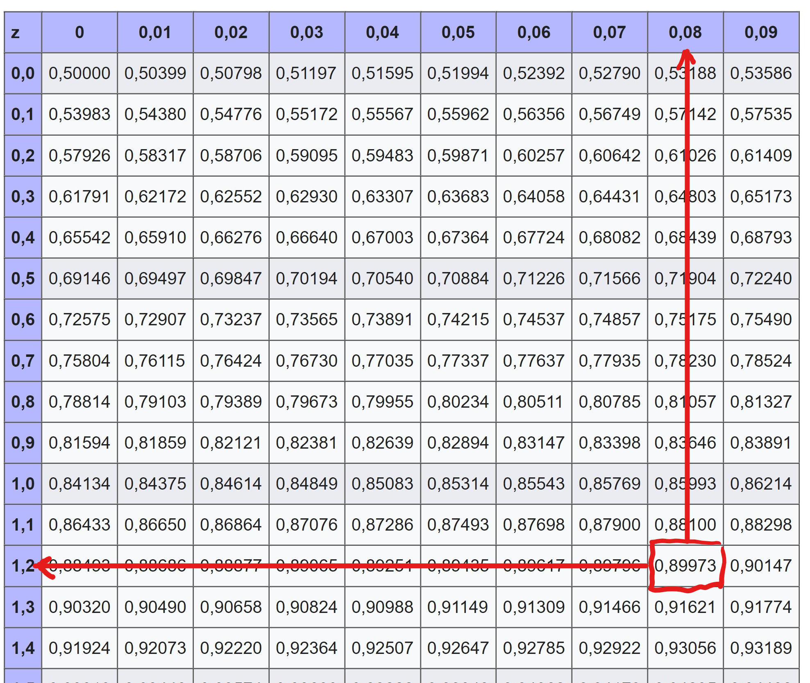

```{r setup, include=FALSE}
rm(list = ls())

knitr::opts_chunk$set(echo = FALSE, message = FALSE)

library(tidyverse)
library(jmv)
library(knitr)
library(kableExtra)
library(openintro)

data(COL)

phydata <- read_csv("../data/physio.csv")
```

# Technische Vorbemerkung

* Die Übungen sind für die Arbeit mit [jamovi](https://www.jamovi.org/) [1] angelegt, können aber mit jeder anderen Statistiksoftware bearbeitet werden.    
* Die Datensätze für alle Übungen können  [hier](https://github.com/lukasstammler/statexercises/blob/main/data/data_statexercises.zip) als zip-Datei heruntergeladen werden. Es wird empfohlen, alle Datensätze im gleichen Ordner abzulegen.   
* Die Datensätze liegen im `.csv`-Format vor (header = TRUE, sep = ",", dec = ".") und können direkt in jamovi geöffnet werden. Es wird empfohlen, nach der Kategorisierung der Variablen in jamovi, die Datei im jamovi-Format `.omv` zu speichern.   
    
[1] The jamovi project (2021). jamovi (Version 1.6) [Computer Software]. Retrieved from https://www.jamovi.org  


# Wahrscheinlichkeiten  

Zum Aufwärmen ein paar einfache Übungen zu Wahrscheinlichkeiten

<br/>

## Übung {.tabset}

### Aufgaben

1. Du wirfst einen 6-seitigen Würfel. Wie gross ist die Wahrscheinlichkeit, beim ersten Wurf eine 6 zu erhalten?    
2. Du wirfst den Würfel nochmals. Wie gross ist die Wahrscheinlichkeit, beim ersten Wurf keine 6 zu erhalten?  
3. Du wirfst den Würfel nochmals. Wie gross ist die Wahrscheinlichkeit, beim 2. Wurf eine 6 zu erhalten.  
4. Du ziehst blind eine Karte aus einem Kartenspiel mit 36 Karten. Wie gross ist die Wahrscheinlichkeit, dass du Herz-As ziehst?  
5. Du ziehst blind eine Karte aus einem Kartenspiel mit 36 Karten. Wie gross ist die Wahrscheinlichkeit, dass du kein Herz-As ziehst?  

<br/>

### Lösungen 

1. Du wirfst einen 6-seitigen Würfel. Wie gross ist die Wahrscheinlichkeit, beim ersten Wurf eine 6 zu erhalten?  

  * Die Wahrscheinlichkeit für jede Seite beträgt p = 1/6; sie ist für jede Seite gleich gross. Damit beträgt die Wahrscheinlichkeit für eine 6 p = 1/6 = ca. 17%  

2. Wie gross ist die Wahrscheinlichkeit, beim ersten Wurf keine 6 zu erhalten?  

  * Du wirst in jedem Fall eine Zahl zwischen 1 und 6 werfen, etwas anderes gibt es nicht. Die Gesamtwahrscheinlichkeit addiert sich zu  
  $$P = 1/6 (für 1) + 1/6 (für 2) + 1/6 (für 3) + 1/6 (für 4) + 1/6 (für 5) + 1/6 (für 6) = 1$$
  
  * Die Wahrscheinlichkeit, keine 6 zu würfeln beträgt also 
  
  $$P(\neq 6) = 1/6 (für 1) + 1/6 (für 2) + 1/6 (für 3) + 1/6 (für 4) + 1/6 (für 5) = 5/6 \approx 83\%$$
  
  * Einfacher geht es so: $P = 1 - P(6) = 1 - 1/6 = 5/6$   
  
3. Du wirfst den Würfel erneut. Wie gross ist die Wahrscheinlichkeit, beim 2. Wurf eine 6 zu erhalten.  

  * Die Wahrscheinlichkeit beträgt immer noch p = 1/6. Die Wahrscheinlichkeit hat ja kein Gedächtnis und erinnert sich nicht daran, dass du schon mal eine 6 gewürfelt hast.   
  * Eine andere Frage wäre: Wie gross ist die Wahrscheinlichkeit, bei 2 Würfen zweimal hintereinander eine 6 zu erhalten. In diesem Fall ist $P(6|6) = 1/6 \times 1/6 = 1/36$.  
  * P(6|6) bezeichnen wir als *bedingte Wahrscheinlichkeit* weil die Bedingung für den zweiten Wurf durch den ersten Wurf definiert ist. Bedingte Wahrscheinlichkeiten spielen z.B. eine Rolle bei der Sensitivität und Spezifität von Assessments und werden im Unterricht dort behandelt. Auch der p-Wert beim Hypothesenprüfen in der Statistik ist eine bedingte Wahrscheinlichkeit: Er gibt an, wie gross die Wahrscheinlichkeit für ein Ereignis ist unter der Bedingung, dass die Nullhypothese wahr ist. Aber ich greife jetzt etwas vor, das kommt später ;)  

4. Du ziehst blind eine Karte aus einem Kartenspiel mit 36 Karten. Wie gross ist die Wahrscheinlichkeit, dass du Herz-As ziehst?   

  * Bei 36 Karten beträgt die Wahrscheinlichkeit, eine bestimmte Karte zu ziehen $P = 1/36$  
  
5. Du ziehst blind eine Karte aus einem Kartenspiel mit 36 Karten. Wie gross ist die Wahrscheinlichkeit, dass du kein Herz-As, also eine x-beliebige andere Karte, ziehst? $P = 1 - 1/36 = 35/36$  
  
<br/>

# Normalverteilung und z-Werte

Wir arbeiten mit dem bereits bekannten Datensatz `physio.csv`, der Daten von 228 Physiostudierenden der Kohorten PHY13-PHY17 enthält. Der Datensatz liegt in 2 Versionen vor:  

* `physio.csv`: Textdatei im CSV-Format; die Variablen müssen gemäss Codebook erst kategorisiert werden.  
* `physio.omv`: Datei im `jamovi`-Format; die Variablen sind bereits kategoriesiert.

Der Datensatz umfasst 9 Variablen:  

Variable |	Beschreibung | Skala | Werte
|:--------:|:-------------:|:-----:|:------:|
ID | ID | nominal | 1 ... n
Kohorte |	Jahrgang Studierende | nominal | PHY13 … PHY17
Klasse | Klasse 1 oder 2 | nominal | 1, 2
Geschlecht | Geschlecht | nominal| m = maennlich, w = weiblich
Augenfarbe | Augenfarbe | nominal | gruen, blau, braun
Groesse	| Körpergrösse in cm | kontinuierlich | 148 … 198
Gewicht |	Körpergewicht in kg | kontinuierlich |	47 … 105
Statistik |	Das Fach Statistik interessiert mich |ordinal| (Likert-Skala) 1 = trifft überhaupt nicht zu, 2 = trifft eher nicht zu, 3 = egal, 4 = trifft eher zu, 5 = trifft vollstänig zu
Schuhgroesse | Schuhgrösse in DE/EU-Einheiten |diskret| 35, 36 … 48


## Einführung

### Grösse der Studentinnen PHY13-PHY17

```{r, fig.align='center'}
phy_w <- phydata %>% 
    filter(Geschlecht == "w")

phy_w %>% 
    summarise(
        n = n(),
        m = mean(Groesse),
        median = median(Groesse),
        s = sd(Groesse),
        min = min(Groesse),
        max = max(Groesse)
    ) %>% 
    kbl(digits = 2, caption = "Kennzahlen zu Studentinnen PHY13-PHY17") %>% 
  kable_minimal(full_width = FALSE)

phy_w %>% 
    ggplot(., aes(x = Groesse)) +
    geom_histogram(aes(y = ..density..), 
                   bins = 15, fill = "skyblue", color = "white") +
    stat_function(fun = dnorm, 
                  args = list(mean = mean(phy_w$Groesse), sd = sd(phy_w$Groesse)),
                  color = "red", size = 1) +
    ggtitle("Groesse der Studentinnen in cm") +
  ylab("")
```
   
   
   
### Umwandlung der Verteilung in eine Standard-Normalverteilung

Die Standardnormalverteilung ist gekennzeichnet durch den Mittelwert 0 und die Standardabweichung 1. Die Umwandlung einer beliebigen Verteilung erfolgt nach der Formel:

$$z_n=\frac{x_n-\bar{x}}{s}$$

**Beispiel:** (Mittelwert und Standardabweichung siehe oben)

$$z_n=\frac{x_n-166.92}{5.66}$$


```{r, fig.align='center'}
phy_w <- phy_w %>% 
    mutate(
        Groesse_std = (Groesse- mean(Groesse))/sd(Groesse)
    )

phy_w %>% 
    ggplot(., aes(x = Groesse_std)) +
    geom_histogram(aes(y = ..density..), 
                   bins = 15, fill = "skyblue", color = "white") +
    stat_function(fun = dnorm, 
                  args = list(mean = mean(phy_w$Groesse_std), 
                              sd = sd(phy_w$Groesse_std)),
                  color = "red", size = 1) +
    ggtitle("Standardnormalverteilung der Groesse der Studentinnen PHY13-PHY17") +
    ylab("") +
    xlab("Standardisierte Grösse")
```
  
Wir sehen, dass das standardisierte Histogramm und die standardisierte Normalverteilungskurve genau gleich aussehen, wie mit den nicht transformierten Originaldaten. Was bringt uns das also?   
    
Wenn wir beliebige, normalverteilte Merkmale messen, werden wir immer wieder neue Normalverteilungen mit ihrem eigenen Mittelwert und ihrer eigenen Standardabweichung erhalten. D.h. die Normalverteilungskurve wird manchmal breiter, manchmal schmaler, manchmal höher, manchmal tiefer sein. Jedes beliebige Merkmal weist seine charakteristische Verteilung auf. In der Statistik interessieren wir uns oft für die Wahrscheinlichkeit, dass ein bestimmtes Ereignis eintritt (z.B. das Ereignis, dass eine Studentin 168 cm gross ist) und effektiv ist die Normalverteilung eine Wahrscheinlichkeitsverteilung. Die Berechnung von Wahrscheinlichkeiten erfolgt über die Berechnung von Flächeninhalten unter der Normalverteilungskurve wobei die gesamte Fläche unter der Kurve stets gleich 1 ist (Tönt kompliziert, ist es aber nicht. Wir werden das unten üben). Die Berechnung von Flächen unter Kurven ist tatsächlich eine nicht ganz triviale Angelegenheit. Um diese Berechnungen zu erleichtern, wurde die Standardnormalverteilung "erfunden". Die Standardisierung erfolgt über die Berechnung von sog. z-Werten. Die z-Werte-Tabelle ist ein Hilfsmittel, das es uns erlaubt, für beliebige Normalverteilungen beliebige Flächeninhalte und somit Wahrscheinlichkeiten zu berechnen.


### Arbeiten mit z-Werten

Uns interessiert jetzt die Frage *Wie gross ist die Wahrscheinlichkeit, dass eine Studentin PHY13-PHY17 eine bestimmte Körpergrösse aufweist?*. Aus hier nicht näher erläuterten Gründen ist es nicht möglich, diese Wahrscheinlichkeit exakt zu berechnen (sie wäre gleich Null). Was jedoch möglich ist, ist die Beantwortung der Frage *Wie gross ist die Wahrscheinlichkeit dass eine Studentin gleich gross oder grösser, bzw. kleiner ist?*.

**Beispiel:** Wie gross ist die Wahrscheinlichkeit, dass eine Studientin 163 cm gross oder kleiner ist?

$$z_{163} = \frac{163 - 166.92}{5.66} = -0.693$$

```{r, fig.align='center'}
phy_w %>% 
    ggplot(., aes(x = Groesse)) +
    stat_function(fun = dnorm, 
                  args = list(mean = mean(phy_w$Groesse), 
                              sd = sd(phy_w$Groesse)),
                  color = "red", size = 1) +
    geom_vline(aes(xintercept = 163), color = "purple", size = 1) +
    ggtitle("Groesse der Studentinnen PHY13-PHY17",
            subtitle = "Vertikale Linie bei 163 cm") +
    ylab("")
```


Die Wahrscheinlichkeit, dass eine Studentin 163 cm gross oder kleiner ist, entspricht der Grösse der Fläche unter der Kurve links von der violetten Linie. Wir können schon von blossem Auge sagen, dass die Wahrscheinlichkeit kleiner als 50% sein muss, da die violette Linie bei 163 cm die Fläche in eine kleinere linke und eine grössere rechte Fläche teilt.  


```{r, fig.align='center'}
phy_w %>% 
    ggplot(., aes(x = Groesse)) +
    geom_area(stat = "function", fun = dnorm, 
              args = list(mean = mean(phy_w$Groesse), sd = sd(phy_w$Groesse)), 
              fill = "skyblue", alpha = .5, xlim = c(145, 163)) +
    stat_function(fun = dnorm, 
                  args = list(mean = mean(phy_w$Groesse), 
                              sd = sd(phy_w$Groesse)),
                  color = "red", size = 1) +
    geom_vline(aes(xintercept = 163), color = "purple", size = 1) +
    ggtitle("Groesse der Studentinnen PHY13-PHY17",
            subtitle = "Vertikale Linie bei 163 cm") +
    ylab("")
```

Aber wie genau berechnet man jetzt die Grösse der blauen Fläche? Bevor Computerprogramme die Berechnung übernommen haben, hat man sich mit sogenannten z-Werte-Tabellen (siehe z.B. http://eswf.uni-koeln.de/glossar/zvert.htm) beholfen. Weil es unmöglich ist für alle möglichen Verteilungen  Tabellen zu berechnen, wurde die z-Transformation entwickelt. Damit lassen sich beliebige Normalverteilungen in eine standardisierte Verteilung umwandeln. Heute übernimmt diese Arbeit der PC, wir machen es hier aber von Hand, um zu verstehen, was da vorgeht. 

**Übung:** Welche Wahrscheinlichkeit gibt die Z-Wertetabelle für den z-Wert `r (163 - mean(phy_w$Groesse))/sd(phy_w$Groesse)` an?

```{r}
p_lowertail <- pnorm(163, mean = mean(phy_w$Groesse), sd = sd(phy_w$Groesse), lower.tail = TRUE)
```

Der Computer berechnet die Wahrscheinlichkeit, dass eine Studentin in PHY13-PHY17 163 cm oder kleiner ist mit p = `r p_lowertail`.

**Übung:** Wie gross ist die Wahrscheinlichkeit, dass eine Studentin 163 cm oder grösser ist?

Dies ist die Umkehrung der Frage. Da die Wahrscheinlichkeit dafür, dass die Studentin 163 cm oder kleiner ist jetzt bekannt ist, lässt sich die Frage ganz einfach beantworten, da bekanntlicherweise die Fläche unter der Kurve gleich 1 ist.

Lösung: Die Wahrscheinlichkeit, dass eine Studentin 163 cm oder grösser ist beträgt

$$1-(Wahrscheinlichkeit für \leq 163 cm) = 1-0.2403793$$
also p = `r 1-p_lowertail`.


## Übungen 

* Arbeite mit der z-Werte-Tabelle (http://eswf.uni-koeln.de/glossar/zvert.htm) oder mit der R-Konsole in `jamovi`.  
* Alle Übungen werden mit dem Teildatensatz für Studentinnen (jamovi:Filter **= Geschlecht == "w"**) durchgeführt.  
* Für gewisse Übungen muss das Modul *Rj - Editor to run R code inside jamovi* installiert sein.  

## Übung 1 {.tabset}  

Ziel: z-Werte für Körpergrössen von Studentinnen berechnen     

### Aufgaben

1. Wie gross ist der z-Wert für die Körpergrösse 176 cm?
2. Wie gross ist der z-Wert für die Körpergrösse 166.94 cm?
3. Wie gross ist der z-Wert für die Körpergrösse 195 cm?

<br/> 
<br/>
   


### Lösungen

1. $z = \frac{176 - 166.9396}{5.587423} = 1.62157$   
    
2. $z = \frac{166.94 - 166.9396}{5.587423} = 7.158935 \times 10^{-5} \approx 0$      
    
3. $z = \frac{195 - 166.9396}{5.587423} = 5.022065$

<br/> 
<br/>
  


## Übung 2 {.tabset}

Ziel: Wahrscheinlichkeiten für Körpergrössen von Studentinnen berechnen.   


### Aufgaben  

Erstelle jeweils eine Skizze für jede Frage und überlege, ob der z-Wert jeweils links oder rechts vom Mittelwert liegt und ob p kleiner oder grösser 50% ist.   

1. Wie gross ist die Wahrscheinlichkeit, dass eine Studentin 176 cm oder kleiner ist?
2. Wie gross ist die Wahrscheinlichkeit, dass eine Studentin 176 cm oder grösser ist?
3. Wie gross ist die Wahrscheinlichkeit, dass eine Studentin 166.924 cm oder kleiner ist?
4. Wie gross ist die Wahrscheinlichkeit, dass eine Studentin 166.924 cm oder grösser ist?
5. Wie gross ist die Wahrscheinlichkeit, dass eine Studentin 195 cm oder grösser ist?
6. Wie gross ist die Wahrscheinlichkeit, dass eine Studentin zwischen 163 cm und 176 cm gross ist?

<br/> 
<br/>
  


### Lösungen

Vorgehen:    

- Rj-Editor öffnen   
- Die Funktion zur Berechnung von Wahrscheinlichkeiten unter der Normalverteilung in R heisst 'pnorm()'.    
- Damit 'pnorm()' die Wahrscheinlichkeit für einen bestimmten *Wert* berechnen kann, benötigt die Funktion die Kennzahlen der Verteilung *Mittelwert* und *Standardabweichung*, daraus ergibt sich die Syntax von pnorm()

$$pnorm(Wert, mean = Mittelwert,~ sd = Standardabweichung, ~ lower.tail = FALSE/TRUE)$$


- Der Parameter *lower.tail* gibt an, ob die Fläche unter der Kurve links vom z-Wert berechnet werden soll (p für $\leq$ z-Wert, lower.tail = TRUE), oder die Fläche unter der Kurve rechts vom Wert (p für $\geq$ Wert, lower.tail = FALSE).  
- Standardmässig ist `lower.tail = TRUE` eingestellt. Statt `lower.tail = FALSE` kann die Fläche rechts vom z-Wert auch als `1 - pnorm()` berechnet werden.  
- Gib den Code mit dem z-Wert in der Klammer im Rj-Editor-Fenster ein und drücke zur Ausführung des Codes den grünen Pfeil oben rechts.

```{r, echo=TRUE, eval=FALSE}
pnorm(z-Wert)          # Fläche links vom z-Wert  
1 - pnorm(z-Wert)      # Fläche rechts vom z-Wert
```


Zur Erinnerung: Mittelwert und Standardabweichung für die Grösse der Studentinnen sind

```{r}
phy_w %>% 
  summarise(
    Mittelwert = mean(Groesse),
    Standardabweichung = sd(Groesse)
  ) %>% 
  kbl(digits = 3) %>% 
  kable_minimal(full_width = FALSE)
```


1. Wert = 176, Mittelwert = 166.924, Standardabweichung = 5.664, Frage nach p $\leq$ z-Wert   


```{r, fig.dim=c(4, 4), fig.align='center'}
value <- 176
m <- 166.924
s <- 5.664
z <- round((value - m)/s, 3)
tit <- paste("z-Wert =", z)
normTail(m = m, s = s, L = value, col = COL[1], digits = 0, main = tit)
```

```{r, echo=TRUE}
pnorm(176, mean = 166.924, sd = 5.664, lower.tail = TRUE)
```

2. Wert = 176, Mittelwert = 166.924, Standardabweichung = 5.664, Frage nach p $\geq$ z-Wert  

```{r, fig.dim=c(4, 4), fig.align='center'}
value <- 176
m <- 166.924
s <- 5.664
z <- round((value - m)/s, 3)
tit <- paste("z-Wert =", z)
normTail(m = m, s = s, U = value, col = COL[1], digits = 0, main = tit)
```

```{r, echo=TRUE}
pnorm(176, mean = 166.924, sd = 5.664, lower.tail = FALSE)
1 - pnorm(176, mean = 166.924, sd = 5.664)  # ergibt das gleiche Resultat
```

3. Wert = 166.9, Mittelwert = 166.924, Standardabweichung = 5.664, Frage nach p $\leq$ z-Wert

```{r, fig.dim=c(4, 4), fig.align='center'}
value <- 166.9
m <- 166.924
s <- 5.664
z <- round((value - m)/s, 3)
tit <- paste("z-Wert =", z)
normTail(m = m, s = s, L = value, col = COL[1], digits = 0, main = tit)
```


```{r, , echo=TRUE}
pnorm(166.924, mean = 166.924, sd = 5.664, lower.tail = TRUE)
```

4. Wert = 166.9, Mittelwert = 166.924, Standardabweichung = 5.664, Frage nach p $\geq$ z-Wert  

```{r, fig.dim=c(4, 4), fig.align='center'}
value <- 166.9
m <- 166.924
s <- 5.664
z <- round((value - m)/s, 3)
tit <- paste("z-Wert =", z)
normTail(m = m, s = s, U = value, col = COL[1], digits = 0, main = tit)
```

```{r, echo=TRUE}
pnorm(166.924, mean = 166.924, sd = 5.664, lower.tail = FALSE) 
1 - pnorm(166.924, mean = 166.924, sd = 5.664)  # ergibt das gleiche Resultat
```

5. Wert = 195, Mittelwert = 166.924, Standardabweichung = 5.664, Frage nach p $\geq$ Wert  

```{r, fig.dim=c(4, 4), fig.align='center'}
value <- 195
m <- 166.924
s <- 5.664
z <- round((value - m)/s, 3)
tit <- paste("z-Wert =", z)
normTail(m = m, s = s, U = value, col = COL[1], digits = 0, main = tit, xlim = c(127, 207))
points(x = 195, y = 0, col = COL[4], cex = 2, pch = 19)
```

```{r, echo=TRUE}
pnorm(195, mean = 166.924, sd = 5.664, lower.tail = FALSE)
```

6. Lösungsweg: Berechne die Wahrscheinlichkeit, dass eine Studentin kleiner als 176 cm ist (grüne Fläche) und ziehe von diesem Wert die Wahrscheinlichkeit ab, dass eine Studentin kleiner als 163 cm gross ist (rote Fläche).

```{r, fig.width=9, fig.asp=.3, fig.align='center'}
par(mfrow = c(1, 3))

value <- 176
m <- 166.924
s <- 5.664
z <- round((value - m)/s, 3)
tit <- paste("z-Wert =", z)
normTail(m = m, s = s, L = value, col = COL[2], digits = 0, main = tit)

value2 <- 163
z2 <- round((value2 - m)/s, 3)
tit <- paste("z-Wert =", z2)
normTail(m = m, s = s, L = value2, col = COL[4], digits = 0, main = tit)

tit = paste(z2, "<= z <=", z)
normTail(m = m, s = s, M = c(value2, value), col = COL[1], digits = 0, main = tit)

par(mfrow = c(1, 1))
```

```{r, echo=TRUE}
pnorm(176, mean = 166.924, sd = 5.664, lower.tail = TRUE) - pnorm(163, mean = 166.924, sd = 5.664, lower.tail = TRUE)
```


```{r, fig.align='center', eval=FALSE}
phy_w %>% 
    ggplot(., aes(x = Groesse)) +
    geom_area(stat = "function", fun = dnorm, 
              args = list(mean = mean(phy_w$Groesse), sd = sd(phy_w$Groesse)), 
              fill = "skyblue", alpha = .5, xlim = c(145, 176)) +
    stat_function(fun = dnorm, 
                  args = list(mean = mean(phy_w$Groesse), 
                              sd = sd(phy_w$Groesse)),
                  color = "red", size = 1) +
    ggtitle("Groesse der Studentinnen PHY13-PHY17",
            subtitle = "Wahrscheinlichkeit, dass die Studentin 176 cm gross oder kleiner ist") +
    ylab("")
```


```{r, fig.align='center', eval=FALSE}
phy_w %>% 
    ggplot(., aes(x = Groesse)) +
    geom_area(stat = "function", fun = dnorm, 
              args = list(mean = mean(phy_w$Groesse), sd = sd(phy_w$Groesse)), 
              fill = "chartreuse2", alpha = .5, xlim = c(145, 163)) +
    stat_function(fun = dnorm, 
                  args = list(mean = mean(phy_w$Groesse), 
                              sd = sd(phy_w$Groesse)),
                  color = "red", size = 1) +
    ggtitle("Groesse der Studentinnen PHY13-PHY17",
            subtitle = "Wahrscheinlichkeit, dass die Studentin 163 cm gross oder kleiner ist") +
    ylab("")
```


```{r, fig.align='center', eval=FALSE}
phy_w %>% 
    ggplot(., aes(x = Groesse)) +
    geom_area(stat = "function", fun = dnorm, 
              args = list(mean = mean(phy_w$Groesse), sd = sd(phy_w$Groesse)), 
              fill = "skyblue", alpha = .5, xlim = c(163, 176)) +
    stat_function(fun = dnorm, 
                  args = list(mean = mean(phy_w$Groesse), 
                              sd = sd(phy_w$Groesse)),
                  color = "red", size = 1) +
    ggtitle("Groesse der Studentinnen PHY13-PHY17",
            subtitle = "Wahrscheinlichkeit, dass die Studentin zwischen 163 und 176 cm gross ist") +
    ylab("")
```

<br/> 
<br/>
  
    
    
## Übung 3 {.tabset}

### Aufgabe

Wie gross ist eine *"normalgrosse"* Studentin in PHY13 - PHY17 (95%-Normbereich)?    

<br/> 
<br/>


### Lösung

Wir erinnern uns, dass unter *"normal"* die zentralen 95% der Merkmalsausprägungen definiert sind. Die zentralen 95% bedeutet, die Fläche unter der Normalverteilungskurve zwischen Mittelwert minus 2 (eigentlich 1.96) Standardabweichungen und Mittelwert plus 2 (eigentlich 1.96) Standardabweichungen.D.h.   
    
$Normbereich_{untere Grenze} = \bar{x}-2s$  
   
$Normbereich_{obere Grenze} = \bar{x}+2s$     
    
Daraus folgt: *"Normalgrosse"* Studentinnen sind zwischen   
    
$Normbereich_{untere Grenze} = 166.92 - 2 \times 5.66 = 166.94 - 11.18 = 155.62$  
   
$Normbereich_{obere Grenze} = 166.92 + 2 \times 5.66 = 166.94 + 11.18 = 178.26$   
   
cm gross.

```{r, fig.align='center'}
phy_w %>% 
    ggplot(., aes(x = Groesse)) +
    geom_area(stat = "function", fun = dnorm, 
              args = list(mean = mean(phy_w$Groesse), sd = sd(phy_w$Groesse)), 
              fill = "skyblue", alpha = .5, xlim = c(155.76, 178.12)) +
    stat_function(fun = dnorm, 
                  args = list(mean = mean(phy_w$Groesse), 
                              sd = sd(phy_w$Groesse)),
                  color = "red", size = 1) +
    ggtitle("Groesse der Studentinnen PHY13-PHY17",
            subtitle = "95%-Normbereich") +
    ylab("") +
    annotate("text", x = c(154.4, 166.94, 179.5), y = .002, label = c("2.5%", "95%", "2.5%"), size = 3, color = "darkblue")
```


<br/> 
<br/>

## Übung 4 {.tabset}

### Aufgabe

Wie gross ist die Wahrscheinlichkeit, dass die Körpergrösse einer Studentin ausserhalb (also oberhalb oder unterhalb) des 95%-Normbereichs liegt?   

<br/> 
<br/>

### Lösung

Die beiden 2.5%-Flächen in der Abbildung zu Aufgabe 3 liegen ausserhalb des 95%-Normbereichs: 100% - 95% = 5%.  

$$p = 0.025 + 0.025 = 0.05 = 5\%$$      

<br/>
<br/>

## Übung 5 {.tabset}

### Aufgabe

1. Wie gross muss eine Studentin mindestens sein, damit sie zu den 10% grössten Studentinnen gehört?  
2. Wie gross ist eine Studentin, die auf der 25. Perzentile liegt?

<br/> 
<br/>

### Lösung

1. Wie gross muss eine Studentin mindestens sein, damit sie zu den 10% grössten Studentinnen gehört?

   a) z-Wert für 90% in z-Tabelle ablesen $z \approx 1.28$, alternativ z-Wert mit der Funktion `qnorm()` in `R` bestimmen (s. unten)
   
 

   b) 
   $$
   z = \frac{x_i - \bar{x}}{s}
   $$
   
   $$
   x_i =\bar{x} + z \times s = 166.9 + 1.28 \times 5.664 = 174.15
   $$  

```{r, echo=TRUE}
## z-Wert für die 90. Perzentile bestimmen
qnorm(.9)

## Groesse auf der 90. Perzentile aus einer Normalverteilung bestimmen
qnorm(.9, mean = mean(phy_w$Groesse), sd = sd(phy_w$Groesse))
```

2. Wie gross ist eine Studentin, die auf der 25. Perzentile liegt?

  a) z-Wert für 25. Perzentile in z-Tabelle ablesen $z \approx -0.67$; alternativ z-Wert mit der Funktion `qnorm()` in `R` bestimmen (s. unten) 
  b) 
   $$
   z = \frac{x_i - \bar{x}}{s}
   $$
   $$
   x_i =\bar{x} + z \times s = 166.9 -0.67 \times 5.664 = 163.1
   $$ 

```{r, echo=TRUE}
## z-Wert für die 25. Perzentile bestimmen
qnorm(.25)

## Groesse auf der 90. Perzentile aus einer Normalverteilung bestimmen
qnorm(.25, mean = mean(phy_w$Groesse), sd = sd(phy_w$Groesse))
```

<br/> 
<br/>