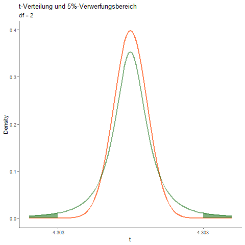

```{r setup, include=FALSE}
rm(list = ls())

knitr::opts_chunk$set(echo = FALSE, 
                      message = FALSE,
                      fig.align = "center")

library(tidyverse)
library(jmv)
library(knitr)
library(kableExtra)
library(openintro)

#data(COL)
```

# Die Funktion pnorm()

Die Funktion `pnorm()` verwenden wir für Flächenberechnungen (also Wahrscheinlichkeiten) 
unter der Normalverteilung. Die Funktion kann mehrere Argumente annehmen, von denen wir zwei 
benötigen:

`pnorm(q, mean = 0, sd = 1, lower.tail = TRUE, log.p = FALSE)`

|Argument|Erläuterung|
|:-------|:----------|
|q | $z$-Wert (z.B. eine Teststatistik)|
|lower.tail| wenn `= TRUE` (Standardeinstellung), wird die Fläche links vom z-Wert berechnet; wenn `= FALSE`, wird die Fläche rechts vom z-Wert berechnet.|

Beispiel: $z$ = 1.1

## Berechnung der Fläche links von $z$

```{r, echo=TRUE}
pnorm(1.1)
```

```{r}
openintro::normTail(L = 1.1, 
                    col = "steelblue",
                    main = "pnorm(1.1)",
                    xlab = "z-Werte")
```

Die blaue Fläche beträgt ca. 86% ($p$ = 0.8643) der Gesamtfläche unter der Kurve.      

## Berechnung der Fläche rechts von $z$

Zwei Möglichkeiten:

```{r, echo=TRUE}
# 1. Möglichkeit
1 - pnorm(1.1)

# 2. Möglichkeit
pnorm(1.1, lower.tail = FALSE)
```

```{r}
openintro::normTail(U = 1.1,
                    col = "steelblue",
                    main = "1 - pnorm(1.1)",
                    xlab = "z-Werte")
```

Die blaue Fläche beträgt ca. 14% ($p$ = 0.1357) der Gesamtfläche unter der Kurve.

# Die Funktion pt()

Die Funktion `pt()` verwenden wir, wenn wir mit der t-Verteilung arbeiten, was bei den Hypothesentests eigentlich immer der Fall ist. Die Funktion arbeitet genau gleich wie `pnorm()` muss allerdings um den Freiheitsgrad $df$ ergänzt werden, da die Form der t-Verteilung vom 
Stichprobenumfang abhängt. Für eine Stichprobe ist $df = n - 1$, für zwei Stichproben ist $df = n_1 + n_2 - 2$. 

Eine einfache Animation zeigt, wie der Stichprobenumfang die Form der $t$-Verteilung und damit die Grenzen ($t$-Werte) zwischen Annahme- und Verwerfungsbereich beeinflusst.  

* orange Kurve: Normalverteilung  
* grüne Kurve: t-Verteilung (df im Untertitel)  
* grüne Fläche: 5%-Verwerfungsbereich unter der t-Verteilung

<center>

</center>

Die Funktion `pt()` kann mehrere Argumente annehmen, von denen wir drei benötigen:

`pt(q, df, ncp, lower.tail = TRUE, log.p = FALSE)`

|Argument|Erläuterung|
|:-------|:----------|
|q | $t$-Wert (z.B. eine Teststatistik)|
|df | Anzahl Freiheitsgrade|
|lower.tail| wenn `= TRUE` (Standardeinstellung), wird die Fläche links vom z-Wert berechnet; wenn `= FALSE`, wird die Fläche rechts vom z-Wert berechnet.|  

Beispiel: $z$ = 1.1, $df$ = 5 ($n$ = 6)   

## Berechnung der Fläche links von $t$

```{r, echo=TRUE}
pt(1.1, df = 5)
```

```{r}
normTail(L = 1.1, 
         df = 4,
         col = "seagreen",
         main = "pt(1.1, df = 5)",
         xlab = "t-Werte")
```

Die blaue Fläche beträgt ca. 84% ($p$ = 0.8393) der Gesamtfläche unter der Kurve.

## Berechnung der Fläche rechts von $t$

```{r, echo=TRUE}
# 1. Möglichkeit
1 - pt(1.1, df = 5)

# 2. Möglichkeit
pt(1.1, df = 5, lower.tail = FALSE)
```

```{r}
normTail(U = 1.1, 
         df = 4,
         col = "seagreen",
         main = "1 - pt(1.1, df = 5)",
         xlab = "t-Werte")
```

Die blaue Fläche beträgt ca. 16% ($p$ = 0.1607) der Gesamtfläche unter der Kurve.

# p-Werte für einseitige Hypothesen  

Einseitige Alternativhypothesen haben die Form   

1. Fall: $H_A: \mu < Nullwert$, der Populationsparameter ist kleiner als der Nullwert.   

oder

2. Fall: $H_A: \mu > Nullwert$, der Populationsparameter ist grösser als der Nullwert.

Wenn wir ein Signifikanzniveau $\alpha$ = 0.05 annehmen, liegt unser Verwerfungsbereich  

im 1. Fall: Im unteren 5%-Bereich der Verteilungskurve ($z$ = -1.645)

```{r}
openintro::normTail(L = -1.645,
                    col = "steelblue",
                    main = "Unterer 5%-Verwerfungsbereich",
                    xlab = "z-Werte")
```

im 2. Fall: Im oberen 5%-Bereich der Verteilungskurve ($z$ = 1.645)  


```{r}
openintro::normTail(U = 1.645,
                    col = "steelblue",
                    main = "Oberer 5%-Verwerfungsbereich",
                    xlab = "z-Werte")
```

## Beispiel  

Wir formulieren eine einseitige Hypothese $H_A: \mu < 0$. Wir erheben drei Stichproben $SP_1, SP_2$ und $SP_3$ und berechnen für jede die Teststatistik $z$: $z_1$ = -2.4, $z_2$ = -1 und $z_3$ = 2.4.

```{r}
openintro::normTail(L = -1.645,
                    col = "steelblue",
                    main = "Unterer 5%-Verwerfungsbereich",
                    xlab = "z-Werte")
points(x = c(-2.4, -1, 2.4), y = c(0, 0, 0), pch = 21, bg = c("red", "green", "purple"), cex = 2)
```

Der rote Punkt repräsentiert $z_1$, der grüne Punkt $z_2$ und der violette Punkt $z_3$. Wie gross ist die Wahrscheinlichkeit, einen $z$-Wert so extrem oder noch extremer (lese: so weit oder noch weiter entfernt von 0) zu erhalten?   

```{r, echo=TRUE}
# für z_1 = -2.4
pnorm(-2.4)

# für z_2 = 1
pnorm(-1) 

# für z_3 = 2.4
pnorm(2.4)
```

Interpretation:  

* $z_1$ liegt im Verwerfungsbereich und wir haben Evidenz gegen die Nullhypothese, $p$ = 0.0082.  
* $z_2$ ist kleiner als 0, liegt aber im Annahmebereich und wir haben keine Evidenz gegen die Nullhypothese, $p$ = 0.1587.   
* $z_3$ liegt gleich weit von Null entfernt wie $z_1$, liegt jedoch im Annahmebereich. Wir haben keine Evidenz gegen die Nullhypothese, $p$ = 0.9918.   

Kommentar: Am Beispiel von $z_3$ können wir die Schwäche von einseitigen Hypothesen erkennen. Obwohl $z_3$ ein extremer Wert ist, können wir die Nullhypothese nicht verwerfen, da unsere Methodik nicht in Betracht zieht, dass extreme Werte auch auf die andere Seite der Alternativhypothese möglich sind. Die einseitige Hypothese ist also "blind" für nicht vorhergesehene Effekte in der anderen Richtung der Alternativhypothese. Da wir bei einem Experiment nie mit Sicherheit wissen können, in welche Richtung sich ein Effekt auswirkt, sollten wir daher darauf verzichten, mit einseitigen Hypothesen zu arbeiten und immer zweiseitige Alternativhypothesen formulieren.   

# p-Werte für zweiseitige Hypothesen  

Zweiseitige Alternativhypothesen haben die Form   

$H_A: \mu \neq Nullwert$, der Populationsparameter unterscheidet sich vom Nullwert.   

Wenn wir ein Signifikanzniveau $\alpha$ = 0.05 annehmen, müssen wir bei zweiseitigen Hypothesen  unseren 5%-Verwerfungsbereich symmetrisch den beiden Enden der Verteilung zuweisen. 

```{r}
openintro::normTail(U = 1.96, L = -1.96,
                    col = "steelblue",
                    main = "5%-Verwerfungsbereich zweiseitig",
                    xlab = "z-Werte")
```

Die 5%-Flächenanteile verteilen sich symmetrisch auf 2.5% auf das linke und 2.5% auf das rechte Ende der Verteilungskurve.   

## Beispiel  

Wir arbeiten mit dem gleichen Beispiel wie oben, formulieren jedoch eine zweiseitige Hypothese $H_A: \mu \neq 0$. Wir erheben drei Stichproben $SP_1, SP_2$ und $SP_3$ und berechnen für jede die Teststatistik $z$: $z_1$ = -2.4, $z_2$ = -1 und $z_3$ = 2.4.

```{r}
openintro::normTail(L = -1.96, U = 1.96,
                    col = "steelblue",
                    main = "5%-Verwerfungsbereich zweiseitig",
                    xlab = "z-Werte")
points(x = c(-2.4, -1, 2.4), y = c(0, 0, 0), pch = 21, bg = c("red", "green", "purple"), cex = 2)
```

Der rote Punkt repräsentiert $z_1$, der grüne Punkt $z_2$ und der violette Punkt $z_3$. Wie gross ist die Wahrscheinlichkeit, einen $z$-Wert so extrem oder noch extremer zu erhalten?   

```{r, echo=TRUE}
# für z_1 = -2.4
2 * pnorm(-2.4)

# für z_2 = 1
2 * pnorm(-1) 

# für z_3 = 2.4
2 * (1 - pnorm(2.4))
```

Interpretation:

* $z_1$ liegt im unteren Verwerfungsbereich und wir haben Evidenz gegen die Nullhypothese, $p$ = 0.0164.  
* $z_2$ liegt im Annahmebereich und wir haben keine Evidenz gegen die Nullhypothese, $p$ = 0.3171.   
* $z_3$ liegt gleich weit von Null entfernt wie $z_1$ und liegt im oberen Verwerfungsbereich. Wir haben Evidenz gegen die Nullhypothese, $p$ = 0.0164.  

Kommentar:  

* Wir erkennen, dass bei einem zweiseitigen Hypothesentest $z_1$ und $z_3$ im 5%-Verwerfungsbereich liegen. Für beide $z$-Werte erhalten wir die identische Wahrscheinlichkeit $p$ = 0.0164.  
* Wenn Du die Berechnung der $p$-Werte für zweiseitige Tests betrachtest, siehst Du, dass die $p$-Werte für ein bestimmtes $z$ jeweils verdoppelt werden müssen. *Warum ist das so?* Ein $p$-Wert gibt die Wahrscheinlichkeit dafür an, ein Resultat (eine Teststatistik) wie das beobachtete oder ein noch extremeres Resultat zu erhalten. Im Fall von zweiseitigen $z$- oder $t$-Tests bedeutet "extremer", einen $z$-/$t$-Wert zu erhalten, der mindestens so weit von Null entfernt ist, wie der beobachtete $z$-/$t$-Wert. Dabei spielt es keine Rolle, ob der $z$-/$t$-Wert ein positives oder negatives Vorzeichen hat, da wir ja auf beide Seiten prüfen und für uns der Abstand zum Nullwert relevant ist. Uns interessiert also eigentlich die Wahrscheinlichkeit für den absoluten $z$-/$t$-Wert: $|z|$ bzw. $|t|$. Dieser kann grösser oder kleiner als Null sein und wir müssen die beiden $p$-Werte für $|z|$ bzw. $|t|$ für beide Möglichkeiten addieren. Da die Normalverteilung bzw. die $t$-Verteilung symmetrisch ist, reicht es, den $p$-Wert für $|z|$ bzw. $|t|$ zu berechnen und dann zu verdoppeln.  

In `R` sieht das dann so aus (z.B. für $z$ = -2.4):   

```{r, echo=TRUE}
2 * (1 - pnorm(abs(-2.4)))

# Alternativ
2 * pnorm(abs(-2.4), lower.tail = FALSE)
```

* `abs(z-Wert)` = Absolutwert für $z$ (d.h. $z$ mit positivem Vorzeichen)  
* `1 - pnorm(abs(z-Wert))` = Fläche unter der Kurve (=Wahrscheinlichkeit) für $\geq z$, d.h. am rechten Ende der Kurve. Statt `1 - pnorm(abs(z-Wert))` kann auch `pnorm(abs(z-Wert), lower.tail = FALSE)` eingegeben werden. Das Resultat ist das selbe, man muss einfach etwas mehr schreiben `r emo::ji("wink")`.   
* `2 *` = Erhaltenen $p$-Wert verdoppeln.

$p$-Werte für die $t$-Verteilung können analog berechnet werden, z.B. für einen Stichrobenumfang $n$ = 6 und ein $t$ = -2.4:

```{r, echo=TRUE}
2 * (1 - pt(abs(-2.4), df = 6 - 1))

# Alternativ
2 * pt(abs(-2.4), df = 6 - 1, lower.tail = FALSE)
```

```{r}
openintro::normTail(L = -2.571, U = 2.571,
                    df = 5,
                    col = "seagreen", 
                    main = "5%-Verwerfungsbereich, df = 5", 
                    xlab = "t-Werte")
points(x = -2.4, y = 0, pch = 21, bg = c("red"), cex = 2)
```

Weil die $t$-Verteilung bei einem kleinen Stichprobenumfang von $n$ = 6 recht breit ist, liegen die Grenzen zum oberen und der unteren Verwerfungsbereich weiter von 0 entfernt: $t_{krit} = \pm 2.571$. Damit kommt der $t$-Wert von -2.4 innerhalb des Annahmebereichs zu liegen und $p$ = 0.0616.  

Mit zunehmendem Stichprobenumfang $n$ nähert sich die $t$-Verteilung der Normalverteilung an: Beispiel mit $n$ = 30 und $t$ = -2.4

```{r, echo=TRUE}
2 * (1 - pt(abs(-2.4), df = 30 - 1))

# Alternativ
# 2 * pt(abs(-2.4), df = 30 - 1, lower.tail = FALSE)
```

```{r}
openintro::normTail(L = -2.04, U = 2.04,
                    df = 29,
                    col = "seagreen", 
                    main = "5%-Verwerfungsbereich, df = 29", 
                    xlab = "t-Werte")
points(x = -2.4, y = 0, pch = 21, bg = c("red"), cex = 2)
```

Mit grösserem $n$ nähern sich die Grenzen der 5%-Verwerfungsbereiche den bekannten Grenzen der Normalverteilung -1.96, 1.96 an und der $t$-Wert von -2.4 kommt in den Verwerfungsbereich zu liegen, $p$ = 0.0230.  

# Zusammenfassung   

* Wahrscheinlichkeiten werden für die Normalverteilung mit `pnorm(z-Wert)` und für die $t$-Verteilung mit `pt(t, df)` berechnet.   
* Beide Funktionen berechnen im Standardmodus (default) jeweils die Wahrscheinlichkeit für Werte gleich oder kleiner als die Teststatistik $z$ bzw. $t$.  
* Die Wahrscheinlichkeit für Werte gleich oder grösser als die Teststatistik kann mit `1 - pnorm(z-Wert)` bzw `1 - pt(z-Wert, df)` berechnet werden.  
* Für eine bestimmte Teststatistik $z$ bzw. $t$ ist der $p$-Wert für zweiseitige Hypothesen doppelt so gross wie für einseitige Hypothesen. 
* Es ist nicht erlaubt, im Nachhinein eine zweiseitige Alternativhypothese in eine einseitige Alternativhypothese umzuformulieren, nur um einen knapp nicht signifikanten $p$-Wert zu halbieren und damit ein signifikantes Ergebnis vorzutäuschen. (Bsp. Du erhältst in deiner Studie mit zweiseitiger $H_A$ einen $p$-Wert von 0.08. Durch nachträgliches Umformulieren der $H_A$ in eine einseitige Hypothese entsprechend deinem, in der Studie erhaltenen, Resultat, würde sich der $p$-Wert auf $p$ = 0.04 halbieren und dein Resultat wäre signifikant auf dem Niveau $\alpha$ = 0.05. `r emo::ji("-1")`)

<br/>