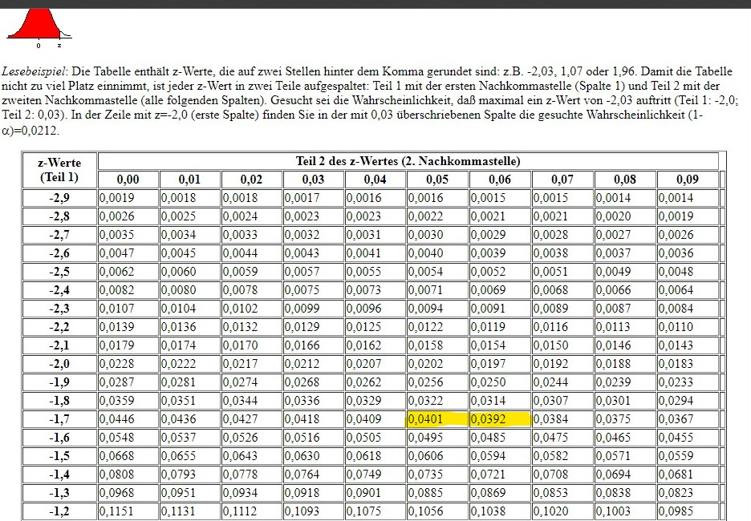

```{r setup, include=FALSE}
rm(list = ls())

knitr::opts_chunk$set(echo = FALSE, message = FALSE)

library(tidyverse)
library(jmv)
library(knitr)
```

# Technische Vorbemerkung

* Die Übungen sind für die Arbeit mit [jamovi](https://www.jamovi.org/) [1] angelegt, können aber mit jeder anderen Statistiksoftware bearbeitet werden.    
* Die Datensätze für alle Übungen können  [hier](https://github.com/lukasstammler/statexercises/tree/main/data) heruntergeladen werden. Es wird empfohlen, alle Datensätze im gleichen Ordner abzulegen. Falls die Meldung erscheint *Github.com hat eine Verbindung verweigert* mit Rechtsklick den Link kopieren und in die Adressleiste im Browser einfügen.    
* Die Datensätze liegen im `.csv`-Format vor (header = TRUE, sep = ",", dec = ".") und können direkt in jamovi geöffnet werden. Es wird empfohlen, nach der Kategorisierung der Variablen in jamovi, die Datei im jamovi-Format `.omv` zu speichern.   
    
[1] The jamovi project (2021). jamovi (Version 1.6) [Computer Software]. Retrieved from https://www.jamovi.org  
    

# Mittelwertsvergleiche: Einstichproben-T-Test

## Kurze Einführung

### Deskriptive Statistik vs. Inferenzstatistik

In der *deskriptiven Statistik* wird ein bekannter Datensatz auf die bestmögliche
Art beschrieben, indem die Datenmenge auf sinnvolle Kennzahlen und Grafiken
reduziert wird. Mit anderen Worten, die deskriptive Statistik hilft uns dabei, 
ein klares Bild von einer bestimmten Menge an Beobachtungen mittels zusammenfassender 
Angaben und grafischen Darstellungen zu erhalten. In der deskriptiven Statistik 
existiert keine Unsicherheit bezüglich der Gültigkeit der Ergebnisse, da nur 
die vorliegenden Daten im Datensatz analysiert werden und kein Versuch unternommen 
wird, die Ergebnisse verallgemeinern.   

Die *Inferenzstatistik* hingegen versucht anhand von Zufallsstichproben (samples) 
aus Populationen verallgemeindernde Schlussfolgerungen (inference = Schlussfolgerung) 
auf eben diese Populationen zu ziehen. Mit anderen Worten, die Information aus 
einer Stichprobe wird verwendet, um die Ergebnisse zu den untersuchten Merkmalen 
auf die gesamte Population zu übertragen.Da die wahren Ausprägungen dieser Merkmale in der 
Population nicht bekannt sind, handelt es sich um Schätzungen, die immer mit 
einer gewissen Unsicherheit verbunden sind.   

Die beiden wichtigsten Werkzeuge der Inferenzstatistik sind  
- Hypothesentests, und    
- Vertrauensintervalle    

**Das Signifikanzniveau wird für alle Übungen auf $\alpha = 0.05$ festgelegt.**    


## Übung 1 {.tabset}

Verwenden Sie für diese Übung den Datensatz `physio.csv` (bzw. `physio.omv`), 
den Sie bereits in früheren Übungen erstellt haben.

```{r}
phydata <- readRDS(file = "../data/physio.rds")
```


### Aufgabe

Die Schweizerische Gesundheitsbefragung im Jahre 2017 ergab, dass Frauen im
Alter von 15 - 24 Jahren ein durchschnittliches Körpergewicht von 67.6 kg
aufweisen. 
Quelle: [BFS](https://www.bfs.admin.ch/bfs/de/home/aktuell/neue-veroeffentlichungen.assetdetail.7586025.html)


Frage: Unterscheidet sich das durchschnittliche Körpergewicht von Physiotherapie-Studentinnen 
von 67.6 kg? (verwenden Sie den Datensatz `physio.csv`)

1. Formulieren Sie die Nullhypothese $H_0$ und die Alternativhypothese $H_A$.
2. Berechnen Sie das 95%-Vertrauensintervall für die Körpergrösse der Studentinnen.
3. Prüfen Sie ihre Hypothese mit einem statistischen Test.
4. Fassen Sie ihr Resultat in ein bis zwei Sätzen zusammen.
<br />
<br />

### Lösung

1. Formulieren Sie die Nullhypothese$H_0$ und die Alternativhypothese $H_A$

- $H_0:$ Das durchschnittliche Gewicht von PHY-Studentinnen unterscheidet sich nicht von 67.5 kg, $\mu_{PHY_W} = 67.6$     
- $H_A:$ Das durchschnittliche Gewicht von PHY-Studentinnen unterscheidet sich von 67.5 kg, $\mu_{PHY_W} \neq 67.6$   

Anmerkung: Inferenzstatistik bezieht sich immer auf Populationen. Daher wird die Hypothese für die Population *PHY-Studentinnen* formuliert (daher $\mu$ und nicht $\bar{x}$) und der Mittelwert der Stichprobe wird als Schätzer für diese Population eingesetzt.    
<br />

2. Berechnen Sie das 95%-Vertrauensintervall für die Körpergrösse der Studentinnen.

- Stichprobenumfang, Mittelwert und Standardabweichung für Groesse (Achtung Filter = Geschlecht == "w") berechnen.   

```{r}
phy_w <- phydata %>% 
  filter(Geschlecht == "w")

descriptives(
  data = phy_w,
  vars = Gewicht,
  sd = TRUE,
  se = TRUE,
  median = FALSE,
  min = FALSE,
  max = FALSE
)
```

- Standardfehler für den Mittelwert berechnen (von Hand oder jamovi: S.E. mean), zur Erinnerung    

$$SE =\frac{s}{\sqrt{n}}$$    

- 95%-Vertrauensintervall für den Mittelwert berechnen. Zur Erinnerung    

$$CI_{95} = \bar{x} \pm 1.96 SE$$
    
```{r}
ci_lo <- round(mean(phy_w$Gewicht) - 1.96 * (sd(phy_w$Gewicht)/sqrt(length(phy_w$Gewicht))), 3)
ci_hi <- round(mean(phy_w$Gewicht) + 1.96 * (sd(phy_w$Gewicht)/sqrt(length(phy_w$Gewicht))), 3)

ci95 <- paste("95%-CI: [", ci_lo, ",", ci_hi, "]")
ci95
```

- Das durchschnittliche Körpergewicht von PHY-Studentinnen beträgt 59.585 [58.618, 60.551] kg.Die Wahrscheinlichkeit dafür, dass bei der Ziehung einer weiteren Stichprobe (vom gleichen Umfang und aus der gleichen Grundgesamtheit) der neu ermittelte Mittelwert zwischen 58.6 kg und 60.6 kg liegt, beträgt mindestens 95 %. 

- Da das 95%-Vertrauensintervall den Referenzwert von 67.6 kg nicht einschliesst, kann die Nullhypothese zugunsten der Alternativhypothese verworfen werden und wir haben Evidenz dafür, dass ein signifikanter Unterschied zwischen dem durchschnittlichen Gewicht von Physiotherapie-Studentinnen und Schweizer Frauen im Alter von 15 - 24 Jahren besteht.   
<br />

3. Teststatistik (kann von Hand berechnet werden)   

- Z-Wert berechnen:   

$$z = \frac{\bar{x} - \mu}{SE}$$

- $\bar{x}$ = Stichprobenmittelwert (hier 59.6 kg einsetzen)      
- $\mu$ = Populationsmittelwert (hier 67.6 kg einsetzen)  
- $SE$ = Standardfehler (hier 0.493 einsetzen)

```{r}
z_value <- round((59.6 - 67.6)/.493, 3)

paste("Z-Wert =", z_value)
```

* Das durchschnittliche Körpergewicht liegt im Abstand von -16 SE von $\mu$ = 67.6 kg entfernt. Aus der Vorlesung wissen Sie, dass ein Abstand von mehr als $\mu \pm 2SE$ im Verwerfungsbereich für $H_0$ liegt. 


```{r}
cord.x <- c(-2, seq(-1.96, 1.96,0.01),2) 
cord.y <- c(0,dnorm(seq(-1.96, 1.96,0.01)),0) 
curve(dnorm(x,0,1),xlim=c(-18,18),main='95%-Annahme- und 5%-Verwerfungsbereich', col = "black")
polygon(cord.x,cord.y,col='lightblue', border = "black")
points(x = -16, y = 0, pch = 21, bg = "orange", col = "red", cex = 2)
```

```{r}
p_value <- pnorm(z_value)
paste("p-Wert =", p_value)
```

- Der p-Wert für z = -16 ist extrem klein und kann nicht aus den Z-Tabellen abgelesen werden. Sie können ihn in jamovi > ttest > One Sample T-Test berechnen:

```{r}
ttestOneS(
  data = phy_w,
  vars = Gewicht,
  testValue = 67.6
)
```

* Der p-Wert von <0.0000001 gibt die Wahrscheinlichkeit dafür an, dass ein Stichprobenmittelwert von 59.6 kg ermittelt wird, wenn der wahre Mittelwert 67.6 kg beträgt. Mit anderen Worten, dass ein Stichprobenmittelwert so unterschiedlich oder noch unterschiedlicher von 67.6 kg ist, als der Mittelwert in unserer Stichprobe. Da der p-Wert < 0.05 ist verwerfen wir die Nullhypothese zu Gunsten der Alternativhypothese.
<br />

4. Fassen Sie ihr Resultat in ein bis zwei Sätzen zusammen.  

**Das durchschnittliche Körpergewicht von Physiotherapie-Studentinnen (59.6[58.6 , 60.5] kg) ist signifikant geringer als das durchschnittliche Körpergewicht in der Population der Schweizerinnen zwischen 15 und 24 Jahren (67.6 kg), z = -16.05, p <.0001.**
<br />
<br />

## Übung 2 {.tabset}

### Aufgabe

New York gilt als "die Stadt, die nie schläft". Eine zufällige Stichprobe von 25 New Yorkern wurde gefragt, wie lange sie pro Nacht schlafen. Die Zusammenfassung der Daten sind in folgender Tabelle dargestellt:

| n | m | s | min | max |
|:-:|:-:|:-:|:---:|:---:|
| 25 | 7.73 | .77 | 6.17 | 9.78 |

Frage: Besteht aus diesen Daten Evidenz dafür, dass New Yorker im Durchschnitt 8 Stunden pro Nacht schlafen?    

1. Formulieren Sie die Nullhypothese $H_0$ und die Alternativhypothese $H_A$.
2. Berechnen Sie das 95%-Vertrauensintervall für die Schlafdauer der New Yorker.
3. Prüfen Sie ihre Hypothese mit einem statistischen Test.
4. Fassen Sie ihr Resultat in ein bis zwei Sätzen zusammen.    
<br />

Quelle: [OpenIntro Statistics, 3rd ed](https://www.openintro.org/index.php)
<br />
<br />

### Lösung

1. Formulieren Sie die Nullhypothese $H_0$ und die Alternativhypothese $H_A$.  

- $H_0:$ Die durchschnittliche Schlafdauer von New Yorkern beträgt 8 Std., $\mu = 8$       
- $H_A:$ Die durchschnittliche Schlafdauer von New Yorkern beträgt nicht 8 Std., $\mu \neq 8$   
<br />

2. Berechnen Sie das 95%-Vertrauensintervall für den Mittelwert der Schlafdauer der New Yorker.   

```{r}
n <- 25
m <- 7.73
s <- .77
se <- .77/sqrt(n)


ci_lo <- m - 1.96 * se
ci_hi <- m + 1.96 * se

paste("95%-Vertrauensintervall: [", ci_lo, ",", ci_hi, "]")
```

- New Yorker schlafen im Durchschnitt 7.73 [7.43, 8.03] Stunden. Das 95%-vertrauensintervall schliesst den Vergleichswert von 8 Stunden ein. Es besteht keine Evidenz für einen Unterschied zwischen der mittleren Schlafdauer von New Yorkern zu 8 Stunden und die Nullhypothese wird nicht verworfen.  
<br />

3. Prüfen Sie ihre Hypothese mit einem statistischen Test.   

```{r}
z_value <- (m - 8)/se
paste("Z-Wert:", z_value)
```

- Der Z-Wert liegt innerhalb von $\mu \pm 2SE$ und somit im Nicht-Verwerfungsbereich von $H_0$. 

```{r}
cord.x <- c(-2, seq(-1.96, 1.96,0.01),2) 
cord.y <- c(0,dnorm(seq(-1.96, 1.96,0.01)),0) 
curve(dnorm(x,0,1),xlim=c(-4,4),main='95%-Annahme- und 5%-Verwerfungsbereich', col = "black")
polygon(cord.x,cord.y,col='lightblue', border = "black")
points(x = -1.75, y = 0, pch = 21, bg = "orange", col = "red", cex = 2)
```

- Der p-Wert für diesen Z-Wert kann in Tabellen nachgesehen oder in jamovi:Rj-Editor berechnet werden.

```{r, echo=TRUE}
# Code für jamovi Rj-Editor
2 * pnorm(-1.7532)
```

 - Da der p-Wert > .05 ist, haben wir keine Evidenz dafür, dass sich die durchschnittliche Schlafdauer von New Yorkern von 8 Stunden unterscheidet und verwerfen die $H_0$ nicht.
<br />

4. Fassen Sie ihr Resultat in ein bis zwei Sätzen zusammen.   

**Die durchschnittliche Schlafdauer von New Yorkern beträgt 7.73 [7.43, 8.03] Stunden und unterscheidet sich nicht von den erwarteten 8 Stunden, z = -1.753, p = .0796.**  

<br />

### Aus Fehlern lernen

Zu dieser Aufgabe wurde folgender Forumeintrag von Studierenden gepostet: "Bei der Berechnung des P-Wertes kommen wir bei Jamovi (0.7957) und der Z-Werte Tabelle (0.0401) auf einen anderen Wert. Bei den Lösungen wurde der Wert von Jamovi verwendet, welchen Lösungsweg sollten wir anwenden?"

Hier noch einmal der Lösungsweg im Detail:   

**Vorgaben**

Referenzwert: $\mu_0$ = 8 Stunden    

Stichprobe:    
- $\bar{x}$ = 7.73    
- $s$ = .77    
- $n$ = 25   

**Fragestellung**    

Liefert unserr Stichprobe Evidenz dafür, dass New Yorker im Durchschnitt 8 Stunden schlafen?   

**1. Hypothesen**    

$H_0$: Die durchschnittliche Schlafdauer in unserer Stichprobe unterscheidet 
sich nicht vom Referenzwert. $\mu_{Stichprobe} = \mu_0$ oder $\mu_{Stichprobe} = 8 h$  
$H_A$: Die durchschnittliche Schlafdauer in unserer Stichprobe unterscheidet 
sich vom Referenzwert. $\mu_{Stichprobe} \neq \mu_0$ oder $\mu_{Stichprobe} \neq 8 h$

**2. Berechnung des 95%-Vertrauensintervalls für den Mittelwert unserer Stichprobe**    

Mit dem 95%-Vertrauensintervall schätzen wir den wahren Mittelwert in der Population 
auf Grundlage der Ergebnisse unserer Stichprobe.  

$$CI_{95} = \bar{x} \pm 1.96 \times \frac{s}{\sqrt{n}}$$

$CI_{95} = \bar{7.73} \pm 1.96 \times \frac{.77}{\sqrt{25}}$ = 
$CI_{95} = \bar{7.73} \pm 1.96 \times .154$ = $CI_{95} = [7.428, 8.032]$  

Da das 95%-Vertrauensintervall den Referenzwert $\mu = 8 h$ beinhaltet, können
wir $H_0$ nicht verwerfen, d.h. es besteht kein signifikanter Unterschied 
zwischen dem geschätzten Populationsmittelwert und dem Referenzwert.

**3. Prüfung der Hypothesen mit dem Einstichproben-t-Test**   

Als erstes berechnen wir den z-Wert:

$z = \frac{\bar{x}-\mu_0}{SE_x}$, wobei ${SE_x = \frac{s}{\sqrt{n}}}$   

$z = \frac{7.73 - 8}{.154} = -1.753$  

In der z-Werte-Tabelle suchen wir die Wahrscheinlichkeit für ein Ereignis mit
dem z-Wert -1.753. Das Problem ist, dass wir in der z-Wertetabelle nur z-Werte
ablesen können bis zwei Stellen nach dem Komma. Unser z-Wert liegt demnach
zwischen -1.75 und -1.76. Jetzt gibt es zwei Möglichkeiten:    

1. Sie runden den berechneten z-Wert einfach auf -1.75 ab. Die z-Werte-Tabelle 
sagt uns, dass für $p_{-1.75} = .0401$.

2. Da unser z-Wert zwischen -1.75 und -1.76 liegt, können sie den Durchschnitt
der beiden p-Werte nehmen (das ist zwar auch nicht ganz präzis, aber etwas besser
als Variante 1): $p_{-1.75} = .0401$ und $p_{-1.76} = .0392$. Das Ergebnis lautet dann  
$p_{-1.755} = \frac{.0401 + .0392}{2} = .03965$.  

image: 

Der p-Wert in der z-Werte-Tabelle gibt die Fläche links unter der Normalverteilungskurve
an (s. Abb. oben links in der z-Tabelle). Dieser Wert wäre dann gültig, wenn 
Sie die Hypothese einseitig formuliert hätten:

$H_A: \mu_{Stichprobe} < \mu_0$   

Da Sie ihre Hypothese aber zweiseitig formuliert haben, müssen Sie den erhaltenen p-Wert verdoppeln:

**$p = 2 \times p_{-1.76} = 2 \times .03965 = .0793$**

Jetzt entspricht ihr berechneter p-Wert so genau wie möglich dem Wert, den 
jamovi berechnet hat. jamovi muss den p-Wert nicht in einer z-Tabelle nachschlagen 
und berechnet den p-Wert auf mathematischer Basis. Deshalb ist dieser Wert etwas 
präziser als der von Hand berechnete Wert.  
<br />

<br />

## Übung 3 {.tabset}

### Aufgabe

Es soll getestet werden, ob die durchschnittliche Laufzeit von Notebook-Akkus möglicherweise von den vom Hersteller angegebenen 7,5 Stunden abweicht. Dazu werden bei 50 Akkus dieser Marke unter kontrollierten gleichen Bedingungen die Laufzeiten gemessen. Das Ergebnis der Untersuchung ist in folgender Tabelle dargestellt

| n | m | s | min | max |
|:-:|:-:|:-:|:---:|:---:|
| 50 | 6.94 | .884 | 5.2 | 9.1 |
<br />

1. Formulieren Sie die Nullhypothese $H_0$ und die Alternativhypothese $H_A$.
2. Berechnen Sie das 95%-Vertrauensintervall für die Akku-Laufzeit
3. Prüfen Sie ihre Hypothese mit einem statistischen Test.
4. Fassen Sie ihr Resultat in ein bis zwei Sätzen zusammen.   
<br />
<br />

### Lösung   

1. Formulieren Sie die Nullhypothese $H_0$ und die Alternativhypothese $H_A$. 

- $H_0:$ Die durchschnittliche Laufzeit der Akkus beträgt 7.5 Std., $\mu = 7.5$       
- $H_A:$ Die durchschnittliche Laufzeit der Akkus beträgt nicht 7.5 Std., $\mu \neq 7.5$
<br />

2. Berechnen Sie das 95%-Vertrauensintervall für die Akku-Laufzeit  


```{r}
n <- 50
m <- 6.94
s <- .884
se <- s/sqrt(n)


ci_lo <- m - 1.96 * se
ci_hi <- m + 1.96 * se

paste("95%-Vertrauensintervall: [", ci_lo, ",", ci_hi, "]")
```

Die gemessene durchschnittliche Akku-Laufzeit beträgt 6.94[6.695, 7.185] Stunden. Das 95%-vertrauensintervall schliesst den Vergleichswert von 7.5 Stunden nicht ein. Es besteht Evidenz dafür, dass die Laufzeit dieser Akkus von der angegebenen Laufzeit von 7.5 Stunden abweicht.     

<br />

3. Prüfen Sie ihre Hypothese mit einem statistischen Test.    

```{r}
z_value <- (m - 7.5)/se
paste("Z-Wert:", z_value)
```

- Der Z-Wert von -4.48 liegt ausserhalb von $\mu \pm 2SE$ und somit im Verwerfungsbereich von $H_0$. 

```{r}
cord.x <- c(-2, seq(-1.96, 1.96,0.01),2) 
cord.y <- c(0,dnorm(seq(-1.96, 1.96,0.01)),0) 
curve(dnorm(x,0,1),xlim=c(-6,6),main='Standard Normal, area = 95% (1.96 sd)', col = "black")
polygon(cord.x,cord.y,col='lightgrey', border = "black")
points(x = -4.48, y = 0, pch = 21, bg = "orange", col = "red", cex = 2)
```

- Der p-Wert für diesen Z-Wert kann im jamovi:Rj-Editor berechnet werden.

```{r, echo=TRUE}
# Code für jamovi Rj-Editor
2*pnorm(-4.48)
```

 - Da der p-Wert < .05 ist, besteht Evidenz dafür, dass sich die durchschnittliche Akku-Laufzeit sich von 7.5 Stunden unterscheidet und verwerfen die $H_0$.
 <br />

4. Fassen Sie ihr Resultat in ein bis zwei Sätzen zusammen.   

**Die durchschnittliche Akku-Laufzeit beträgt 6.94[6.695, 7.185] Stunden und unterscheidet sich signifikant von den erwarteten 7.5 Stunden, z = -4.480, p < 0.0001**   

<br />
<br />


## Übung 4 {.tabset}

### Aufgabe 

Auf Grund ihrer Erfahrung vermuten Sie, dass die Laufzeit von Notebook-Akkus (siehe Übung 3) kürzer ist als in den  Unterlagen angegeben. 

1. Formulieren Sie ihre Hypothesen $H_0$ und $H_A$.
2. Wie unterscheidet sich diese Hypothese von der Hypothese in Übung 3?     
3. Fassen Sie ihr Resultat in ein bis zwei Sätzen zusammen (verwenden Sie ihre Analyse aus Übung 3)   
<br />
<br />

### Lösung

1. Formulieren Sie ihre Hypothesen $H_0$ und $H_A$.

- $H_0$ : Die Akku-Laufzeit ist gleich lang oder länger als 7.5 Stunden, $\mu \ge 7.5$  
- $H_A$ : Die Akku-Laufzeit ist kürzer als 7.5 Stunden $\mu < 7.5$    

2. Wie unterscheidet sich diese Hypothese von der Hypothese in Übung 3?     

- in Übung 3 ist die Hypothese zweiseitig formuliert, in der Übung 4 ist sie einseitig formuliert.   
<br />
<br />

3. Fassen Sie ihr Resultat in ein bis zwei Sätzen zusammen (verwenden Sie ihre Analyse aus Übung 3) 

- **Die durchschnittliche Akku-Laufzeit (6.94[6.695, 7.185] Stunden) ist signifikant ( z = -4.480, p < 0.0001) kürzer als in den Unterlagen mit 7.5 Stunden angegeben.** 
<br />
<br />


